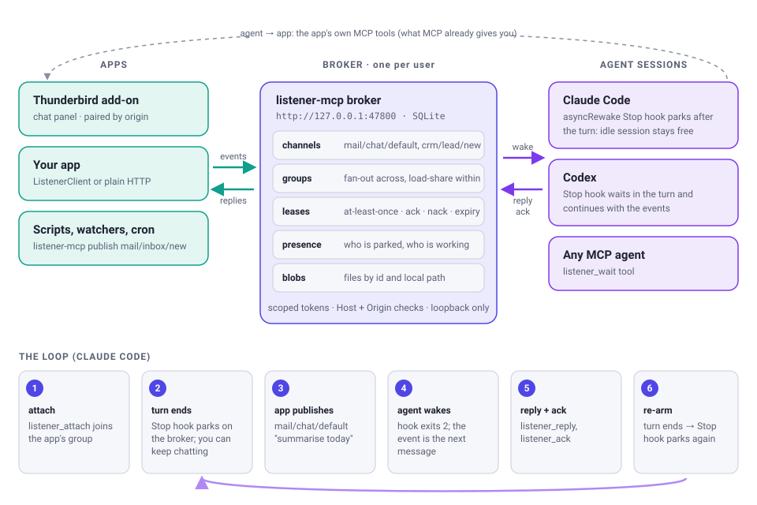
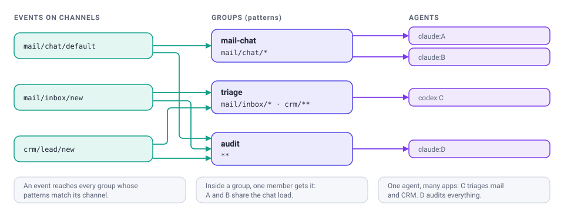

<p align="center">
  
</p>

<h1 align="center">listener-mcp</h1>

<p align="center"><b>The return path of MCP: let your apps reach your coding agents.</b></p>

MCP lets an agent call into your app. It gives the app no way to call the
agent back. listener-mcp adds that direction. An app publishes an event, such
as a chat message, a new email or a finished build, and the agent session
listening for it wakes up, handles the event, and replies.

It's app-agnostic, runs locally, and works with any number of apps and agent
sessions at once.

<p align="center">
  
</p>

## How it works

- A **broker** runs once per user on `127.0.0.1:47800`. It stores events in
  SQLite and knows which agent sessions are listening to which channels.
- **Apps** publish events on **channels** such as `mail/chat/default` or
  `crm/lead/new`, using the JS client or plain HTTP. They read replies the same
  way.
- **Agent sessions** attach to **groups** of channel patterns through the
  `listener` MCP server. Hooks in the agent runtime deliver events to them.
- In **Claude Code**, the session is not blocked while it listens. An
  `asyncRewake` Stop hook waits on the broker *after* the turn has ended, so
  you can keep chatting with the agent. When an event arrives, the hook wakes
  the session with the event as its next message. When that turn ends, the
  hook starts waiting again.

### Many apps, many agents

<p align="center">
  
</p>

There's no need for a port per agent or per app. Routing works by name:

- An event goes to **every group** whose patterns match its channel. Each
  group gets its own copy.
- Within a group, **one member** gets each event. Several agents in one group
  share the load.
- One agent can join **several groups**, so it can listen to several apps in a
  single wait.
- An event can be **addressed** to one agent with `to`.

## Install

Requires Node.js 22.13 or later.

```sh
npm install -g --allow-git=root github:1101AlexZab1011/listener-mcp
# no root? install into your home instead (make sure ~/.local/bin is on PATH):
# npm install -g --allow-git=root --prefix ~/.local github:1101AlexZab1011/listener-mcp

listener-mcp service install     # optional: keep the broker running (systemd / launchd)
listener-mcp doctor              # check the setup
```

`--allow-git=root` is needed from npm 12 on, which refuses git dependencies
unless you opt in. Older npm versions accept the command without it.

Without the service, the broker starts on demand the first time an agent tool
needs it.

## Connect a project

Run this in the project where your agent works:

```sh
listener-mcp init --channels 'myapp/**' --group myapp
```

`init` does the following, and is safe to run again:

- creates an agent token scoped to `myapp/**` and saves it in your user config
  directory, not in the repo;
- creates the durable group `myapp`, so events queue while no agent is
  attached;
- writes `.listener-mcp.json`, which contains no secrets and can be committed;
- adds, for **Claude Code**: `.mcp.json`, hooks in `.claude/settings.json`, and
  the `listener` skill in `.claude/skills/`;
- adds, for **Codex**: `.codex/config.toml`, `.codex/hooks.json`, and the skill
  in `.agents/skills/`.

Restart the agent session, then ask it to *"listen to myapp"*. Codex
additionally asks you to trust the project's hooks (`/hooks`).

## Publish from your app

```sh
listener-mcp token create --name myapp --scopes 'publish:myapp/**,read:myapp/**' --save
```

```js
import { ListenerClient } from "listener-mcp/client";

const client = await ListenerClient.fromEnvironment({ credential: "myapp" });

// fire and forget
await client.publish({ channel: "myapp/builds/failed", data: { text: "Build 812 failed", url } });

// or ask and wait for the agent's answer
const { replies } = await client.publish({
  channel: "myapp/chat/default",
  data: { text: "Summarise today's tickets" },
  waitReplyMs: 120_000,
});

// is anyone listening right now?
const { listening, busy } = await client.presence("myapp/chat/default");
```

Any language works over HTTP:

```sh
curl -s http://127.0.0.1:47800/v1/events \
  -H "authorization: Bearer $TOKEN" -H 'content-type: application/json' \
  -d '{"channel":"myapp/chat/default","data":{"text":"hello agent"}}'
```

Browser extensions can't read token files, so they pair once instead:

```sh
listener-mcp pair --name my-extension --origin moz-extension://<uuid> --scopes 'publish:myapp/**,read:myapp/**,blobs'
```

The extension then calls `POST /v1/pair` once and receives a token bound to its
own origin. The pairing grant expires after 10 minutes and works only once.

## Agent runtimes

|                                  | Delivery                                              | Session free while listening |
|----------------------------------|-------------------------------------------------------|------------------------------|
| Claude Code (CLI and VS Code)    | `asyncRewake` Stop hook wakes the idle session ¹      | **yes**                      |
| Codex CLI                        | Stop hook waits in-turn, continues with the events    | no                           |
| Codex IDE extension              | `listener_wait` MCP tool (hooks are unreliable there) | no                           |
| Any other MCP client             | `listener_wait` MCP tool                              | no                           |

¹ Verified live with Claude Code 2.1.285: an idle session was woken by an app
event, replied, acknowledged, and re-armed. The VS Code extension runs the same
bundled binary.

Codex currently has no way to wake an idle session from outside. A listening
Codex session is therefore busy, much like a parked tool call. Support for a
new runtime is one module in [`src/hosts/`](src/hosts/).

MCP tools available to the agent: `listener_attach`, `listener_detach`,
`listener_wait`, `listener_publish`, `listener_reply`, `listener_ack`,
`listener_nack`, `listener_history`, `listener_status`.

## Delivery guarantees

- **At least once.** A delivered event is leased to one subscription. It is
  redelivered if it isn't acknowledged before the lease expires (15 minutes by
  default; the MCP server extends leases while the session is alive). After 10
  attempts it is dead-lettered.
- **Received means received.** If the waiting process disconnects before the
  response has been fully written, the lease is released at once.
- **Presence is real.** `listening` means a wait is parked right now, not that
  a heartbeat arrived recently. `busy` means an event is leased and not yet
  acknowledged.
- **No echo.** An agent never receives events it published itself, so its own
  replies don't loop back to it.

## Security

- The broker listens on loopback only and checks the `Host` header, which
  blocks DNS-rebinding attacks from web pages.
- Browser requests must come from an origin that a token lists. Unknown
  origins get no CORS headers and a 403.
- Tokens are random 256-bit secrets. Only their SHA-256 hash is stored. Each
  token carries scopes (`publish:`, `subscribe:`, `read:` plus a channel
  pattern, `blobs`, `admin`), and a token can only mint tokens narrower than
  itself.
- Config and credential files are created with mode 0600 in directories with
  mode 0700.
- Event payloads (256 KiB) and blobs (25 MiB) have size limits. Blobs that a
  browser could execute (HTML, SVG, …) are served as downloads.
- Events are app input, not user instructions. The bundled skill tells agents
  to apply normal permission rules and to ask before any action with external
  effects.

## Command line

```text
listener-mcp broker | service install|uninstall|status | status | doctor
listener-mcp init | uninstall
listener-mcp token create|list|revoke | pair
listener-mcp publish <channel> [text] | events <pattern> [--follow]
listener-mcp group create|list|delete | attach | detach | wait | ack | nack
listener-mcp hook <event> --host <claude|codex> | mcp
```

`listener-mcp help` describes every option.

## Documentation

- [Protocol](docs/PROTOCOL.md): the HTTP API, event format and delivery states.
- [Architecture](docs/ARCHITECTURE.md): module layout, design decisions,
  extension points and roadmap.

## License

MIT
